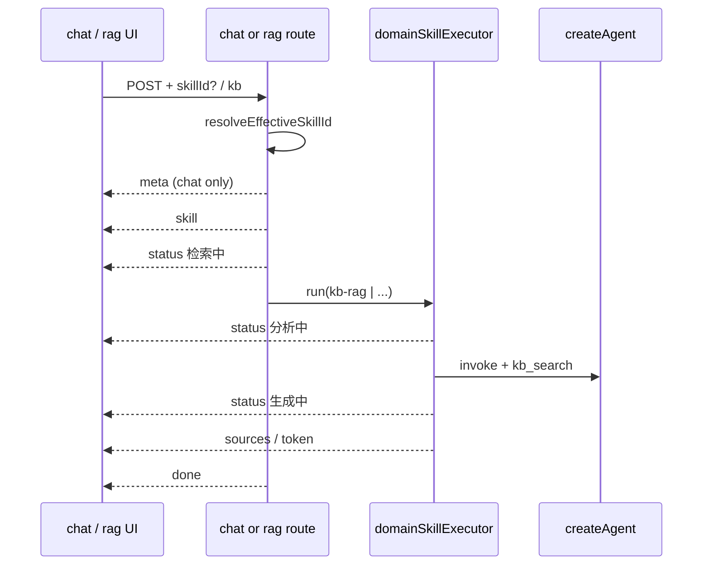

# F-00 业务域 Skill 框架 — 方案设计

> **适用：T3 阶段 2**  
> **前置**：[01-requirements.md](./01-requirements.md)（含 2026-06-03 补充）  
> **修订**：RAG 统一执行器、`kb-rag` Skill、`status` SSE、SSE 断线/超时

## 关联需求

- 需求：`01-requirements.md`
- 补充：RAG 页进 `domainSkillExecutor`；后端阶段反映到前端（短 status）；SSE 韧性

## 背景与目标

建立 **唯一** 文档问答执行路径：`domainSkillExecutor` + 内置 Skill + Platform Tools。  
**RAG 能力** 体现为 Skill **`kb-rag`**，供 RAG 查询页与聊天（隐式 KB）共用。  
用户发送后可见 **极简阶段状态**（非长思维链）。  
**SSE** 统一处理空闲超时、断网、用户停止。

## 需求摘要

| 项 | 说明 |
|----|------|
| 用户 | 聊天 + RAG 页；选 Skill 或仅 KB / 仅 plain |
| 核心 | Agent 多步 tool → 流式生成；`status` 推送阶段 |
| 成功 | 两入口共用 executor；断线可恢复认知（拉历史） |

## 验收标准

| # | 场景 | 预期行为 |
|---|------|----------|
| AC-1 | GET `/api/skills` | 含 `kb-rag`、`bullet-extract` |
| AC-2 | 聊天：`skillId` + KB | `skill` + 多条 `status` + `sources` + `token` + `done` |
| AC-3 | 聊天：无 skill、无 KB | plain；无检索 |
| AC-4 | 聊天：无 skill、有 KB | 后端按 `kb-rag` 执行；落库 `skill_id=kb-rag`；有 `status` |
| AC-5 | RAG 页提交 | 同 executor；默认 `kb-rag`；前端有 `status` |
| AC-6 | `bullet-extract` | 清单式输出 + sources |
| AC-7 | `status.label` | 每条 ≤32 字；无 tool JSON 泄漏 |
| AC-8 | 用户点停止 | `AbortError`；不显示「断网」 |
| AC-9 | 读流空闲超时 | 前端提示「响应超时」类文案；聊天 `loadMessages` |
| AC-10 | 断网 mid-stream | 前端提示连接问题；聊天 `loadMessages`；DB 可有 `[已中断]` |
| AC-11 | 越权 KB | 4xx / SSE `error` |
| AC-12 | lint + build | 通过 |
| AC-13 | scope 内无 embedding 命中 | `status` 或 `error` 提示；`sources` 为空且不编造 |

## 范围

- **纳入：** 下文模块表 + `sseClient` 增强 + chat/rag 前端 status UI
- **不纳入：** 断线自动重试续传、长 CoT 展示、F-11、智能域路由、**F-12 上传可选索引 UI/字段**（仅预留行为）

## 推荐方案总览

**执行器统一 + RAG 即 Skill `kb-rag` + Agent（方案 A）+ `status` SSE + 韧性读流**

### 路由逻辑

```text
resolveEffectiveSkillId(requestSkillId, session.kbId):
  if requestSkillId → requestSkillId
  else if session.kbId → "kb-rag"    // 聊天隐式 RAG，UI 仍可不选
  else → null                        // plain

effectiveSkillId 非 null?
  yes → domainSkillExecutor(effectiveSkillId, scope, sseEmitter)
  no  → streamPlainReply (唯一 legacy)
```

**RAG 查询页**：`skillId` 默认 `kb-rag`；scope 来自 body `knowledgeBaseId`（无 session）。

**删除**：`streamRagReply` 独立分支（逻辑迁入 executor + `kb-rag`）。

### 内置 Skill

| id | name | requires_kb | 说明 |
|----|------|-------------|------|
| **`kb-rag`** | 知识库问答 | yes | **RAG 能力本体**；标准检索 + 引用回答 |
| **`bullet-extract`** | 要点清单提取 | yes | 检索 + 清单 prompt |

### 架构 / 数据流



---

## § RAG 统一

| 入口 | API | skillId | scope |
|------|-----|---------|-------|
| 聊天 | `POST .../messages` | 请求体；null+KB → **`kb-rag`** | `session.knowledge_base_id` |
| RAG 页 | `POST /api/rag/query` | 默认 **`kb-rag`**，可显式覆盖 | `body.knowledgeBaseId` |

`ragQueryHandler` 改为：校验 KB → `setupSse` → `domainSkillExecutor.run({ skillId, query, kbId, userId, sse, signal })`（无 `meta`、不落库消息）。

`chatService.appendMessage`：解析 effectiveSkillId → 有则 executor；无则 plain。

---

## § Platform Tools & Agent

| tool | Agent 可见 | 说明 |
|------|------------|------|
| `kb_search` | yes | 检索；emit `status: { phase: "searching", label: "正在检索…" }` |

生成：`streamFinale` 内调 `answerWithRAGStream`（或 checklist 模板），emit `status: { phase: "writing", label: "正在生成…" }`，再 `sources`/`token`。

`maxSteps`：6（`serviceConstants`）。

---

## § SSE 事件契约

### 事件列表

| event | 何时 | data 示例 |
|-------|------|-----------|
| `meta` | 仅聊天 | `{ userMessageId }` |
| `skill` | 执行器路径 | `{ skillId, skillName }` |
| **`status`** | 阶段变化 | `{ phase, label }` 见下表 |
| `sources` | 检索完成 | 现网结构 |
| `token` | 生成 | `{ text }` |
| `error` | 失败 | `{ message, code? }` |
| `aborted` | 客户端断开/停止 | `{ stopped: true }` |
| `done` | 结束 | 现网 / RAG 页 `{ answer, sources }` |

### `status.phase` 枚举（MVP）

| phase | label 示例 | 触发点 |
|-------|------------|--------|
| `started` | 开始处理 | 进入 executor |
| `searching` | 正在检索… | 调 `kb_search` 前/后 |
| `analyzing` | 正在分析… | Agent invoke 中（可选，与 searching 二选一避免刷屏） |
| `writing` | 正在生成… | `streamFinale` 起 |
| `failed` | 连接中断 / 生成失败 | 终态错误（可选） |

**规则**

- 同一 phase 重复推送时 **覆盖** 前端当前行，不堆叠长日志。
- `label` 后端 `truncate` ≤32 字符；**禁止** CoT、tool 参数全文。
- 可选 `stepIndex`（0,1,2）供 UI 极简步骤点；**不**强制。

**顺序（执行器路径）**

```text
meta → skill → status* → sources → token* → done
         └→ error / aborted
```

### 服务端心跳（P1，建议 MVP 一并做）

长耗时 Agent 阶段每 **20s** 写 SSE 注释行 `: ping\n\n`（`writeSseComment`），降低 nginx/代理空闲断连。  
与 `status` 独立，前端忽略注释。

---

## § SSE 韧性（断网 / 超时 / 停止）

### 问题回顾

现网 `sseClient` 不区分超时/断网；无 `status` 时用户长时间无反馈。

### 前端 `sseClient` / `fetchSsePost`

| 机制 | 行为 |
|------|------|
| **空闲超时** | `readSse` 单次 `read()` 若 **>90s**（常量 `SSE_IDLE_TIMEOUT_MS`）无新字节 → 抛 `SseError { kind: 'idle_timeout' }` |
| **用户停止** | `AbortSignal` → `kind: 'abort'` |
| **fetch/read 失败** | `kind: 'network'`（`Failed to fetch` 等） |
| **HTTP 非 2xx** | 保持现有 `Error` + message |

`fetchSsePost` 对 `onEvent` 增加可选 `onStatus`；`ragApi` / `chatApi` 透传。

### 前端 UI（chat + rag）

| kind | 行为 |
|------|------|
| `abort` | 清空 status；「已停止」；`loadMessages`（chat） |
| `idle_timeout` | status 行显示「等待超时」；`loadMessages`（chat） |
| `network` | 「连接中断」；`loadMessages`（chat） |
| 正常结束 | 清空 status |

RAG 页无会话：断线后保留已渲染 partial + toast，不拉 messages。

### 后端（保持 + 小增强）

| 情况 | 后端 |
|------|------|
| `req.close` / `signal` abort | `isStreamAborted` → `[已中断]` 落库（聊天）；`aborted` 事件若仍可写 |
| 客户端已断开 | `writeSseEvent` 吞错；executor 仍尽量落库（聊天） |
| 业务失败 | `error` + 失败文案落库 |

**不在 MVP 做**：服务端区分「超时」事件（与断网同为连接结束）；若需可在 P2 用 `error.code: 'upstream_timeout'`。

### 共享类型（建议）

`apps/web/src/service/sseErrors.ts`（或 `packages/utils` 若他处复用）：

```ts
export type SseErrorKind = "abort" | "network" | "idle_timeout";
```

---

## 数据模型

（同前）`domain_skills` + `chat_messages.skill_id`  
隐式 `kb-rag` 时 **仍写入** `skill_id = 'kb-rag'`。

---

## 文档索引策略

> 原则：**上传 ≠ 必须向量化**；**语义检索 tool ≠ 全文存储**。F-00 定义 Skill/tool 边界；可选索引能力归 **F-12**。

### 两种「分片」

| 术语 | 模块 | 说明 |
|------|------|------|
| 分片上传 | `chunkUploadService` | 文件传输分块，与向量无关 |
| RAG ingest | `ragService.ingestDocument` | 文本 `RecursiveCharacterTextSplitter` → `embeddings` |

### 现网行为（F-00 不改动上传默认值）

`processAndSaveDocument` → `saveDocument` + **`ingestDocument`**（始终执行）。  
F-00 实现 **不** 拆这条链路，避免与文档管线大范围耦合。

### Tool 与索引依赖

| Tool | 依赖 `embeddings` | 可仅用 `documents.content` |
|------|-------------------|---------------------------|
| `kb_search` | ✅ 必须 | ❌ |
| `streamFinale` / cited 生成 | 间接（通常先 search） | 若未来直读全文 tool 则可 bypass |
| Skill 工坊材料 Job（F-11） | 可选 | ✅ 可读全文/摘要 |

### `kb_search` 无索引时的行为（F-00 必做）

```text
retrieve → 0 chunks
  → sse status { phase: "failed", label: "未找到可用的检索索引" }
     或 error { message, code: "NO_INDEXED_DOCS" }（二选一，实现定）
  → 不生成伪造 sources
```

scope 内文档尚未 ingest（F-12 后 `indexing_status != indexed`）时 **同样视为无检索结果**。

### F-12 预留（不在 F-00 建表亦可，代码留注释/类型）

**`documents` 扩展（建议）**

| 列 | 类型 | 说明 |
|----|------|------|
| `indexing_status` | ENUM | `pending` \| `indexed` \| `skipped` \| `failed` |
| `indexed_at` | TIMESTAMP NULL | |

**策略**

| policy | 行为 |
|--------|------|
| `vector`（默认） | 上传后 `ingestDocument`，置 `indexed` |
| `none` | 只存 `content`，`skipped`；`kb_search` SQL 过滤 |
| `on_demand` | 首次 `kb_search` 触发异步 Job（后续） |

**上传 API**（后续）：`POST` 增加 `indexForSearch?: boolean`，默认 `true` 兼容现网。

### 与 executor 的接口约定

- `buildScope` 返回 `kbId` + 可选 `documentIds`；**不**在 F-00 内对每个 doc 强制 ingest。
- `scopeEnforcer` 与检索 SQL 在 F-12 后增加：`AND (d.indexing_status = 'indexed' OR d.indexing_status IS NULL)`（迁移前 NULL 视为已索引，兼容旧数据）。

---

## 涉及模块

| 层 | 路径 | 变更 |
|----|------|------|
| DB | `database.ts` | `domain_skills` seed；`chat_messages.skill_id` |
| 后端 | `src/domainSkill/*` | registry、tools、scope、executor、**statusEmitter** |
| 后端 | `services/chatService.ts` | effectiveSkillId + executor |
| 后端 | `services/chatStreamHelpers.ts` | 删除 rag 分支；plain 保留 |
| 后端 | `routes/ragQueryHandler.ts` | **改调 executor** |
| 后端 | `utils/sse.ts` | `writeSseComment`（心跳） |
| 前端 | `service/sseClient.ts` | 空闲超时、SseError、onStatus |
| 前端 | `service/chatApi.ts` / `ragApi.ts` | handlers.onStatus |
| 前端 | `pages/chat/*` | Skill 选择 + **StreamStatusLine** 组件 |
| 前端 | `pages/rag/*` | status 展示 |
| 组件 | `packages/components` 可选 | 极简 status 行（或 web 内私有） |

---

## 前端 UI：思考过程（极简）

参考 DeepSeek「思考中」，但 **单行优先**：

```
[ 正在检索… ]  →  [ 正在生成… ]  →  （消失，显示正文流）
```

- 默认 **1 行** `label`；可选展开见最近 3 条 `status`（折叠，非 MVP 可只做 1 行）。
- 与 `streamingAssistantId`、rAF buffer 并列，不挡输入框。
- `token` 开始后隐藏或置灰 status 行。

---

## 方案对比（修订）

| 方案 | 决定 |
|------|------|
| C — RAG 不迁执行器 | **否决**（2026-06-03） |
| RAG 作为 `kb-rag` Skill | **采纳** |
| 长 CoT SSE | **否决**；用 `status` 短标签 |

## 风险与未决项

| 风险 | 缓解 |
|------|------|
| Agent 变慢 + status 仍觉卡 | 心跳 + 首条 `status` <500ms 内发出 |
| status 刷屏 | 节流：同 phase 500ms 内不重复 |
| 隐式 kb-rag 与用户「无默认」认知冲突 | UI 无选中时展示「知识库问答（自动）」只读提示（可选 P1） |
| RAG 页无 meta | 文档写清事件子集 |
| 用户以为「上传即可搜」但 F-12 前仍全 ingest | 文档说明现网；F-12 后改 UI 文案 |
| 空 KB / 全 skipped 检索 | AC-13 + 明确 error |

## 验证计划

- [ ] `design-review` + AC 表
- [ ] 目视：聊天三路径 + RAG 页 + 断网/DevTools offline
- [ ] 可选 E2E：`status` 事件出现；断线后 messages 一致

## 下一步

- [ ] **用户确认本方案（修订版）**
- [ ] `03-implementation-plan.md`
- [ ] `feature-development`

## 确认记录

| 项 | 值 |
|----|-----|
| 状态 | 已确认 |
| 确认人 | 用户 |
| 确认时间 | 2026-06-03 |
| 备注 | 用户授权进入实现 |
