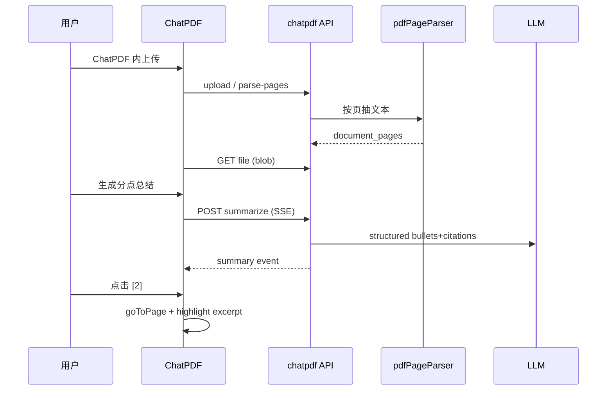

# F-05 ChatPDF — 方案设计

> **适用：T3 阶段 2**  
> **落盘路径**：`.ai/planning/feat-f-05-chatpdf/02-solution-design.md`  
> **前置**：[01-requirements.md](./01-requirements.md) 已确认

## 关联需求

- [01-requirements.md](./01-requirements.md)

## 背景与目标

在桌面壳内交付 **ChatPDF**：左侧 **pdf.js 阅读器**，右侧 **分点总结**；引用为 **递增数字**，点击后 **跳页 + 页内 excerpt 搜索高亮**。文档 **仅通过 ChatPDF 上传**，与 **知识库完全解耦**（用户确认修订）。

## 需求摘要

| 项 | 说明 |
|----|------|
| 用户 | 已登录用户 |
| 核心场景 | 打开 PDF → 生成分点总结 → 点击 `[n]` 定位原文 |
| 引用粒度 | 页码 + excerpt 搜索（无全局 offset） |

## 验收标准

| # | 场景 | 预期行为 |
|---|------|----------|
| AC-1 | Dock 打开 ChatPDF | 窗口可用；空态可上传 PDF |
| AC-2 | 上传 PDF | 解析成功；左栏渲染；`document_pages` 有记录 |
| AC-3 | KB/Finder 列表 | **不**出现 ChatPDF 上传的文档 |
| AC-4 | 生成分点总结 | 右栏分点列表；每点含 `[n]`；有 `status`/loading |
| AC-5 | 点击 `[3]` | 左栏跳到对应页；页内 excerpt 高亮或 toast「仅跳转到第 N 页」 |
| AC-6 | 无文本 PDF | 上传/打开失败，明确提示 |
| AC-7 | 未授权 documentId | API 404 |
| AC-8 | 引用合法性 | 总结中 `citeIds` 均存在于 citations；页码 ≤ 总页数 |
| AC-9 | `pnpm lint` + `pnpm build` | 通过 |

## 范围

- **纳入：** 下文数据模型、API、解析、前端布局、跳转、ChatPDF 独立文档域。
- **明确不纳入：** 知识库关联、Finder「ChatPDF 打开」、复用 `knowledge-bases/upload`。
- **不纳入：** OCR、多 PDF、对话 RAG、bbox、E2E（用户同意后）。

## 约束与假设

| 类别 | 约定 |
|------|------|
| PDF 库 | 前端 **`react-pdf`**（`pdfjs-dist`）；后端解析 **`pdfjs-dist` legacy build** 抽每页文本 |
| 页数上限 | `CHATPDF_MAX_PAGES = 200`；超出拒绝或只处理前 200 页（02 实现取 **拒绝**） |
| 总结 | LLM 输出 **JSON**（Zod 校验）后流式渲染 bullet 文本；或 SSE `citation` + `bullet` 事件 |
| 存储 | PDF 二进制仍用现网 `file_path` + `StorageProvider`（local MVP） |

---

## 数据模型

### 新表 `document_pages`

| 列 | 类型 | 说明 |
|----|------|------|
| `id` | INT PK | |
| `document_id` | INT FK | → `documents.id` CASCADE |
| `page_number` | INT | **从 1 开始** |
| `text` | TEXT | 该页提取文本 |
| `char_count` | INT | 可选，统计用 |
| UNIQUE | `(document_id, page_number)` | |

### `documents` 扩展

| 列 | 类型 | 说明 |
|----|------|------|
| `page_count` | INT NULL | 解析后写入 |
| `parse_status` | VARCHAR(16) | `none` \| `pending` \| `ready` \| `failed` |
| `origin` | VARCHAR(16) NOT NULL DEFAULT `'knowledge_base'` | **`chatpdf`** \| `knowledge_base` — 隔离列表与 API |

**ChatPDF 落库约定：**

- `origin = 'chatpdf'`
- `knowledge_base_id = NULL`（表已允许 NULL）
- `file_type = '.pdf'`
- 现有 KB 文档保持 `origin = 'knowledge_base'`（迁移默认）

**查询隔离：**

- `listDocumentsInKnowledgeBase`：`AND d.knowledge_base_id = ? AND (d.origin = 'knowledge_base' OR d.origin IS NULL)`（兼容迁移前无列）
- ChatPDF 列表（可选 MVP）：`GET /api/chatpdf/documents` → `user_id` + `origin = 'chatpdf'`

### 总结缓存（MVP）

表 **`document_pdf_summaries`**（或 JSON 列在 documents — 推荐独立表便于覆盖）：

| 列 | 类型 |
|----|------|
| `document_id` | PK/FK |
| `bullets_json` | JSON |
| `citations_json` | JSON |
| `updated_at` | TIMESTAMP |

**Citation JSON 形状：**

```typescript
type PdfCitation = {
  id: number;       // 1..N 展示编号
  page: number;     // >= 1
  excerpt: string;  // 页内可搜索片段，建议 20～120 字
};

type PdfBullet = {
  text: string;
  citeIds: number[];
};
```

---

## API 设计

基路径建议：`/api/chatpdf`（独立模块，避免挤占 `knowledgeBases` 路由长度）。

| 方法 | 路径 | 说明 |
|------|------|------|
| POST | `/upload` | multipart PDF；创建 **ChatPDF 域** document + 按页解析；返回 `{ documentId, pageCount }` |
| GET | `/documents` | 当前用户 `origin=chatpdf` 的文档列表（MVP 可选，至少支持「最近打开」） |
| POST | `/documents/:docId/parse-pages` | 已有 ChatPDF 文档补解析（如上次中断） |
| GET | `/documents/:docId/file` | `Content-Type: application/pdf` 流；校验归属 |
| GET | `/documents/:docId/pages` | 可选：调试/预检；MVP 可仅内部用 |
| POST | `/documents/:docId/summarize` | SSE：`status` → `summary`（含 bullets+citations）或 `token` 流式 bullet；结束 `done` |
| GET | `/documents/:docId/summary` | 读缓存的上次总结 |

**鉴权：** 所有接口 `requireUserId`；document 必须 `user_id` 匹配且 **`origin = 'chatpdf'`**（防止用 ChatPDF API 访问 KB 文档）。

**与知识库：**

- **不**写入 `knowledge_base_id`；**不**调用 `knowledgeBases` 上传路由。
- **不**在 Finder / `KnowledgeBaseDocumentRow` 增加 ChatPDF 入口。
- 实现用 **`chatpdfDocumentService.saveChatPdfDocument`**，勿复用 `documentService.saveDocument(userId, kbId, …)`。

---

## 按页解析（后端）

**模块：** `apps/backend/src/services/pdfPageParserService.ts`

```text
parsePdfToPages(filePath | Buffer):
  1. pdfjs getDocument
  2. for page 1..numPages (cap CHATPDF_MAX_PAGES):
       getTextContent → join items → page.text
  3. return { pageCount, pages: [{ pageNumber, text }] }
```

- 写入 `document_pages`；更新 `documents.content` = pages.join('\n\n')；`page_count`、`parse_status=ready`。
- Word 等非 PDF：**不提供** ChatPDF 打开（前端隐藏按钮）。

**触发时机：**

| 时机 | 行为 |
|------|------|
| `POST /api/chatpdf/upload` | 同步解析（MVP）；大文件可改异步 + 轮询 |
| 打开已有 ChatPDF 文档且未 ready | `POST parse-pages` |

---

## 分点总结生成

**模块：** `pdfSummarizeService.ts`

1. 读取 `document_pages` 拼上下文（超长按页压缩：先每页 1 句 preview 再汇总 — 超 `PDF_SUMMARY_MAX_INPUT` 时）。
2. LLM **structured output**（Zod）：

```typescript
const SummarizeSchema = z.object({
  bullets: z.array(z.object({
    text: z.string(),
    citeIds: z.array(z.number().int().positive()),
  })),
  citations: z.array(z.object({
    id: z.number().int().positive(),
    page: z.number().int().positive(),
    excerpt: z.string().min(8).max(200),
  })),
});
```

3. **服务端校验：**
   - 每个 `citeId` 存在于 `citations`
   - `page <= page_count`
   - `excerpt` 出现在 `document_pages[page].text`（归一化空白后 `includes`），否则剔除或降级为仅页码
4. 写入 `document_pdf_summaries`；SSE 推送完整结构给前端。

**Prompt 要点：**

- 输出 5～12 条 bullet，中文
- 每条 1～3 个 citeId
- excerpt 必须摘自对应页原文子串

---

## 前端架构

### 路由与桌面壳

```typescript
// types.ts — ChatPDF 窗仅 documentId
export type WindowMeta = {
  documentId?: number;
};

// appRegistry
{ id: "chatpdf", available: true, ... }
APP_COMPONENTS.chatpdf = lazy(() => import("@/pages/chatpdf/index.tsx"));
```

**`openChatPdf({ documentId, title? })`**：若已开同 docId 则 focus。上传成功后直接 `openChatPdf({ documentId })`。

### 页面布局 `pages/chatpdf/`

```text
ChatPdfPage
├── ChatPdfToolbar（上传、生成总结）
├── ChatPdfLayout（flex 行）
│   ├── ChatPdfViewer（左，flex 1，min-width 0）
│   └── ChatPdfSummaryPanel（右，width 360px）
```

- 样式：`macbook-ui` + `chatpdf.css`；复用 `scrollable-layout` skill。

### PDF 阅读器 `ChatPdfViewer.tsx`

- `react-pdf`：`Document file={pdfUrl}` `Page pageNumber={currentPage}`
- `pdfUrl` = `/api/chatpdf/documents/:id/file` + axios blob / 带 Authorization 的 fetch（**禁止** 裸 URL 无 token → 使用 **blob URL** 或 query token 短期，02 实现 **fetch + blob**）
- **Citation 跳转 API（组件 ref）：**

```typescript
type ChatPdfViewerHandle = {
  goToCitation: (c: PdfCitation) => void;
};

function goToCitation(c) {
  setPageNumber(c.page);
  requestAnimationFrame(() => highlightExcerptOnPage(c.excerpt));
}
```

**`highlightExcerptOnPage`：**

1. 取当前页 text layer DOM（react-pdf `customTextRenderer` 或页内 `window.find` / 自实现 normalize 搜索）
2. 归一化：`\s+` → 空格，中英文标点半角
3. 找到则 `mark`/`span.chatpdf-hl`；找不到 `message.info('已跳转到第 N 页，未定位到原文片段')`

### 总结面板 `ChatPdfSummaryPanel.tsx`

- 渲染 bullets：`BulletText` 解析末尾 `[1]` 或分离渲染 `citeIds.map(id => <CitationLink />)`
- 点击 → `viewerRef.current?.goToCitation(citationsById.get(id))`
- 状态：idle / loading（SSE status）/ error / ready

### 与知识库 UI

- **不修改** `KnowledgeBaseDocumentRow` / Finder（无「ChatPDF 打开」）。
- ChatPDF 空态仅 **上传**；可选侧栏「最近 ChatPDF 文档」调 `GET /api/chatpdf/documents`。

---

## 架构图



---

## 涉及模块

| 层 | 路径 | 变更 |
|----|------|------|
| DB | `database.ts` | `document_pages`、`document_pdf_summaries`、`documents.page_count` |
| 后端 | `services/pdfPageParserService.ts` | 新建 |
| 后端 | `services/pdfSummarizeService.ts` | 新建 |
| 后端 | `routes/chatpdf.ts` | 新建 |
| 后端 | `server.ts` | mount `/api/chatpdf` |
| 后端 | `services/chatpdfDocumentService.ts` | 新建：ChatPDF 专用 CRUD（origin=chatpdf） |
| 后端 | `documentService` 列表查询 | 过滤 `origin != chatpdf` |
| 前端 | `package.json` | 依赖 `react-pdf`、`pdfjs-dist` |
| 前端 | `pages/chatpdf/*` | 新建 |
| 前端 | `desktop/appRegistry.tsx`、`types.ts` | 启用 + meta（仅 documentId） |
| 前端 | `service/chatpdfApi.ts` | 新建 |

---

## 风险与缓解

| 风险 | 缓解 |
|------|------|
| pdf.js 与后端解析文本不一致 | 均以 pdfjs 提取；excerpt 校验用 DB 页文本 |
| JWT 与 PDF blob | fetch 带 Authorization header |
| 大 PDF 同步解析阻塞 | 页数上限 200；后续改 Job |
| 误用 KB documentId 调 ChatPDF API | 服务端强制 `origin = 'chatpdf'` |
| excerpt 搜索失败 | 仍跳页 + 提示（AC-5） |

---

## 实施顺序

1. DB + `pdfPageParserService` + parse API  
2. `GET` PDF file + 前端 Viewer 空壳可显示  
3. `pdfSummarizeService` + SSE + Summary 面板  
4. Citation 跳转 + 高亮  
5. Dock 启用 + 上传流 + KB 列表隔离验证  
6. lint/build + 手测 AC  

---

## 验证计划

- [ ] `design-review` 对照 AC
- [ ] 实现后 `post-implementation`、`code-quality`
- [ ] 用户目视验收
- [ ] E2E 经同意后补「打开 PDF + 总结按钮可见」

---

## 确认记录

| 项 | 值 |
|----|-----|
| 状态 | **已确认** |
| 确认人 | 用户 |
| 确认时间 | 2026-06-04 |
| 备注 | MVP 页码+搜索高亮；**文档与知识库不关联**（`origin=chatpdf`，`knowledge_base_id=NULL`） |
