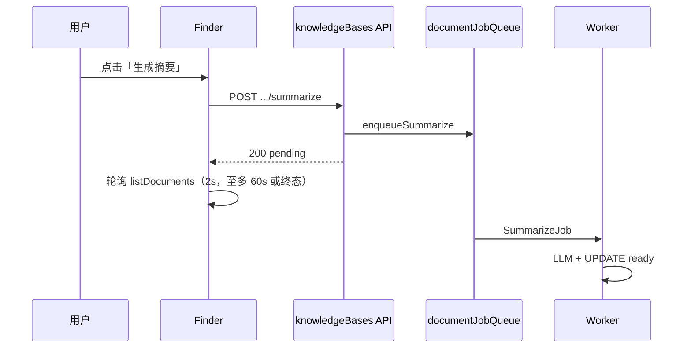
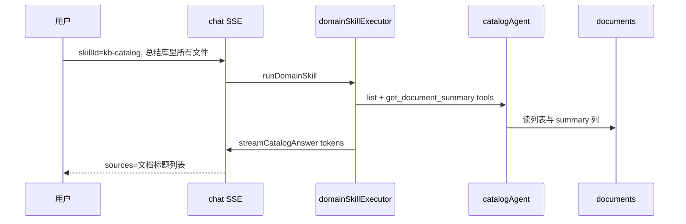

# F-12 文档索引与预摘要 — 方案设计

> **适用：T3 阶段 2**  
> **落盘路径**：`.ai/planning/feat-f-12-doc-index-summary/02-solution-design.md`  
> **前置**：[01-requirements.md](./01-requirements.md) 已确认

## 关联需求

- 需求文档：`.ai/planning/feat-f-12-doc-index-summary/01-requirements.md`
- 前置实现：`.ai/planning/feat-f-00-domain-skill/02-solution-design.md`（executor、SSE、`kb_search`）

## 背景与目标

**价值：** 文档入库与「可检索」「可概览」解耦；用户可在 Finder 按需建立向量索引、预生成摘要；聊天中通过 **`kb-catalog`** 基于 **已存摘要** 做全库级汇总，避免 F-00 仅用 top-K 片段冒充「总结所有文件」。

**目标：**

1. 上传默认 **仅落库** `documents.content`。
2. Finder 显式触发 **摘要 Job** / **索引 Job**，列表可见状态。
3. `kb_search` 仅命中 **已索引** 文档；`kb-catalog` 列举全库并读 **已存摘要** 后流式汇总。

## 需求摘要

| 项 | 说明 |
|----|------|
| 用户 / 角色 | 已登录用户，在自有 KB 的 Finder 与绑定 KB 的聊天中使用 |
| 核心场景 | 上传 → 按钮摘要/索引 → 选「知识库概览」问全库总结 |
| 成功标准（业务） | 见下文 **验收标准** |

## 验收标准（可测试、可观察）

| # | 场景 | 预期行为 |
|---|------|----------|
| AC-1 | 上传 PDF/Word 到 KB | 成功入库；Finder 显示「未索引」「未摘要」；**无**自动 ingest |
| AC-2 | 点击「生成摘要」 | 按钮 loading；`summary_status` → pending → ready；列表见「已摘要」；失败可重试 |
| AC-3 | 点击「建立检索索引」 | pending → indexed；`kb-rag` 问答可检索到该文档片段 |
| AC-4 | 仅摘要、不索引 | 摘要 ready；`kb_search` **不**命中该 doc |
| AC-5 | 仅索引、不摘要 | indexed；`kb-catalog` 汇总时该 doc 出现在「未生成摘要」列表 |
| AC-6 | 聊天选 `kb-catalog` 问「总结知识库里的文件」 | SSE 有 skill/status/token；回答 **按文档分条**；sources 为文档标题列表 |
| AC-7 | 全库 0 篇 ready 摘要 | 不编造；提示去 Finder 生成摘要 |
| AC-8 | 旧数据（已有 embeddings） | 迁移后仍可被 `kb_search` 命中（NULL/`indexed`） |
| AC-9 | 删除文档 | embeddings 与 summary 随文档删除 |
| AC-10 | 未授权 docId | summarize/index API 404 |
| AC-11 | `pnpm lint` + `pnpm build` | 通过 |

## 范围

- **纳入：** 见 01 §范围 MVP；本文件细化表结构、API、Job、executor 分支、Finder、F-00 增量。
- **不纳入：** 上传勾选、聊天批量摘要、智能路由（P1）、on_demand 索引（P2）、E2E（用户同意后）。

## 约束与假设

| 类别 | 约定 |
|------|------|
| 技术 | Node 进程内 **单 worker 队列**（MVP）；同一文档同类型 Job **串行** |
| 鉴权 | 所有 API 走 `requireUserId` + `getOwned(kbId)` + `getDocumentScoped` |
| 性能 | 单篇摘要输入截断 **12_000** 字符；输出目标 **≤800** 中文字；索引 Job 同步 ingest（大文件可 P1 改纯异步） |
| 假设 | 单 KB 文档数 MVP **<200**；`list_kb_documents` 一次返回全量 |

## 现状与复用

| 现有能力 | 路径 | 用法 |
|----------|------|------|
| 解析入库 | `documentService.processAndSaveDocument` | 去掉末尾 `ingestDocument`；INSERT 时写 status 列 |
| 向量 ingest | `ragService.ingestDocument` / `deleteEmbeddingsForDocument` | IndexJob；删除文档前清 embeddings（已有） |
| 检索 scope | `buildEmbeddingScopeFilter`、`ragMultiRecall` `buildScope` | 增加 `indexing_status` 条件 |
| Skill 执行器 | `domainSkillExecutor` | **分支**：`kb-catalog` 不走 `streamSkillRag` |
| Agent + tool | `runSkillAgent`、`createKbSearchTool` | 仿照新增 catalog tools |
| 流式生成 | `ragService.yieldRagTokens` / `buildRagGenerationMessages` | catalog 复用 LLM 流式，上下文改为「各文档摘要块」 |
| Finder 列表 | `KnowledgeBaseDocumentList`、`knowledgeBaseApi.listDocuments` | 扩展字段与行内操作 |
| 聊天 Skill 下拉 | `ChatSkillSelect`、`GET /api/skills` | registry 增 `kb-catalog` 自动出现 |

## 方案对比

### 方案 A — 进程内队列 + 显式 API（推荐）

- **概要：** `POST summarize` / `POST index` 入队；后台 worker 顺序执行；Finder 轮询列表（上传成功/点击后 `loadDocuments`）。
- **优点：** 无新基础设施；与 MVP 范围一致。
- **缺点：** 多实例部署时 Job 不共享（后续可换 Redis/Bull）。

### 方案 B — 同步 index、仅摘要异步

- **概要：** `index` 在请求线程内 `await ingestDocument`；仅 `summarize` 异步。
- **优点：** 索引完成即可搜，无轮询。
- **缺点：** 大 PDF 阻塞 HTTP；上传体验差。

### 方案 C — 聊天内按需摘要

- **概要：** `kb-catalog` 对无摘要文档自动 `POST summarize` 并等待。
- **优点：** 用户少点一次按钮。
- **缺点：** SSE 超长、成本不可控；与 01 决策冲突。

## 推荐方案

**采用方案 A**（摘要与索引 **均异步**）；索引 Job 内部 `await ingestDocument`（worker 内执行，不阻塞 API 响应）。

---

## 数据模型

### `documents` 扩展

| 列 | 类型 | 默认（新行） | 说明 |
|----|------|--------------|------|
| `indexing_status` | `VARCHAR(16)` | `'none'` | `none` \| `pending` \| `indexed` \| `failed` |
| `indexed_at` | `TIMESTAMP NULL` | NULL | 成功索引时间 |
| `summary` | `TEXT NULL` | NULL | 预生成摘要正文 |
| `summary_status` | `VARCHAR(16)` | `'none'` | `none` \| `pending` \| `ready` \| `failed` |
| `summary_at` | `TIMESTAMP NULL` | NULL | 摘要完成时间 |

**迁移（`database.ts`）**

1. `ALTER TABLE` 增加上表五列（若不存在）。
2. **回填 indexed：**  
   `UPDATE documents d SET indexing_status = 'indexed', indexed_at = COALESCE(d.updated_at, d.created_at) WHERE EXISTS (SELECT 1 FROM embeddings e WHERE e.document_id = d.id)`  
3. 其余行：`indexing_status = 'none'`（新列默认即可）。
4. `summary_status` 默认 `none`；不自动回填摘要。

**检索兼容 SQL 片段（统一函数）**

```sql
AND (d.indexing_status = 'indexed' OR d.indexing_status IS NULL)
```

用于：`retrieveRelevantChunks`、`ragMultiRecall` `buildScope`、`kb_search` 间接路径。

### 类型（后端）

`Document` 接口扩展上述字段；列表 API **不**返回 `content` / 完整 `summary`（仅 `summary_preview` 可选，前 **120** 字）。

---

## API 设计

基路径：`/api/knowledge-bases/:kbId/documents`（沿用 `knowledgeBases.ts`）。

| 方法 | 路径 | 行为 |
|------|------|------|
| GET | `/` | 列表增加 `indexing_status`, `summary_status`, `summary_preview?` |
| POST | `/:docId/summarize` | 校验归属；若 `pending` → **409** `{ error: '摘要生成中' }`；否则 `summary_status=pending` 并入队 SummarizeJob → `{ success: true }` |
| POST | `/:docId/index` | 若 `pending` → 409；若已 `indexed` → **200** `{ success: true, alreadyIndexed: true }`；否则 `pending` 并入队 IndexJob |

**SummarizeJob**

```text
1. getDocumentScoped → content
2. truncate(content, DOCUMENT_SUMMARY_MAX_INPUT_CHARS)
3. LLM 单次调用（非流式）→ summary 文本
4. UPDATE summary, summary_status='ready', summary_at=NOW()
5. 失败 → summary_status='failed'，保留旧 summary（若有）
```

**IndexJob**

```text
1. deleteEmbeddingsForDocument(docId)   // 重建索引时幂等
2. ingestDocument({ text: content, documentId, title, ... })
3. indexing_status='indexed', indexed_at=NOW()
4. 失败 → indexing_status='failed'
```

**Prompt（摘要，常量 `documentSummaryPrompt.ts`）**

```text
系统：你是文档摘要助手。根据【文档全文】生成简洁中文摘要：
- 一段概述（2～4 句）
- 可选 3～5 条 bullet 关键信息
- 不要编造文中不存在的内容
- 总长度不超过 800 字
```

### 上传管线变更

| 入口 | 变更 |
|------|------|
| `processAndSaveDocument` | `saveDocument` 时带 `indexing_status='none'`, `summary_status='none'`；**删除** `ingestDocument` |
| `chunkUploadMerge` → `persistMergedDocument` | 同上 |

失败回滚逻辑不变：删 document 行 + 删文件（无 embeddings 可删）。

---

## 文档 Job 队列

**模块：** `apps/backend/src/services/documentJobQueue.ts`（新建）

```text
enqueueSummarize(userId, kbId, docId)
enqueueIndex(userId, kbId, docId)

内部：FIFO 队列 + processing 标志
同一 (docId, type) 在 pending 时 API 已 409，worker 侧再 guard
```

启动：在 `server.ts` 或模块 load 时 **不** 必须显式 start；首次 enqueue 触发 worker loop。

**NFR：** Job 内捕获异常写 `failed`，不抛到 unhandled。

---

## Platform Tools（F-00 增量）

| Tool | 参数 | 返回 | scope |
|------|------|------|-------|
| `list_kb_documents` | 无（scope 注入） | `{ documents: [{ id, title, summary_status, indexing_status }] }` | `userId` + `knowledgeBaseId` |
| `get_document_summary` | `documentId: number` | `{ status, title?, summary? }` | 校验 doc 属于 scope KB |

- `status=ready` 时带 `summary`（全文，Agent 上下文再截断）。
- `none` / `pending` / `failed`：**无** summary 字段，附 `hint` 文案。

**文件：**

- `domainSkill/listKbDocumentsTool.ts`
- `domainSkill/getDocumentSummaryTool.ts`
- `domainSkill/runCatalogAgent.ts` — 仅注册上述 tools
- `domainSkill/streamCatalogAnswer.ts` — 汇总流式输出
- `domainSkill/catalogTypes.ts` — `CatalogAgentState`

### Skill 注册 `kb-catalog`

```typescript
{
  id: "kb-catalog",
  name: "知识库概览",
  description: "列举知识库内文档，基于已生成的文档摘要做全库汇总",
  requiresKb: true,
  systemPolicy:
    "用户询问知识库整体、所有文件、全库总结时：先 list_kb_documents，再对每个 summary_status 为 ready 的文档调用 get_document_summary。" +
    "未 ready 的文档在最终回答中单独列出并提示用户到知识库管理生成摘要。不要编造未提供的摘要内容。",
  allowedTools: ["list_kb_documents", "get_document_summary"],
}
```

`types.ts`：`DomainSkillId` 增加 `"kb-catalog"`；`DomainSkillRunParams.skillId` 同步。

### `domainSkillExecutor` 分支

```text
getSkillById(skillId)
  ├─ id === "kb-catalog"
  │     emitStatus: started → listing → reading → writing
  │     runCatalogAgent(...) → CatalogAgentState
  │     streamCatalogAnswer(state, query, history) → { answer, sources }
  │     sources: ChatSource[] = 参与汇总的 doc { id, title }（无 chunk 级引用）
  └─ 其他（kb-rag, bullet-extract）
        现路径不变：runSkillAgent(kb_search) → streamSkillRagAnswer
```

**`streamCatalogAnswer` 上下文拼装**

```text
【知识库文档摘要】
### {title} (id={id})
{summary}

（未生成摘要的文档：…列表…）

【用户问题】
{query}
```

- 若 **0** 条 ready 摘要：流式输出固定引导文案（不调用长上下文 LLM），`sources=null`。
- 总上下文超 `CATALOG_CONTEXT_MAX_CHARS`（建议 **24_000**）时：按文档 id 顺序截断末篇摘要。

**status 阶段文案**

| phase | label 示例 |
|-------|------------|
| started | 开始处理 |
| listing | 正在列举文档… |
| reading | 正在读取摘要… |
| writing | 正在生成汇总… |
| failed | 处理失败 |

（复用 `emitStatus`；`StatusPhase` 扩展 `listing` | `reading` 或在 catalog 专用 emitter。）

### `kb_search` 索引过滤

- `buildEmbeddingScopeFilter` 增加：`d.indexing_status = 'indexed' OR d.indexing_status IS NULL`
- `ragMultiRecall.buildScope` 同步增加相同 `AND`

---

## 架构 / 数据流

### Finder：摘要 / 索引



### 聊天：`kb-catalog`



### 与 `kb-rag` 分工

| 用户意图 | Skill | 数据依赖 |
|----------|-------|----------|
| 语义问答、细节引用 | `kb-rag`（隐式或显式） | `embeddings` |
| 全库概览、逐文档总结汇总 | `kb-catalog`（**显式选择** MVP） | `documents.summary` |

---

## 前端设计

### API 类型（`knowledgeBaseApi.ts`）

```typescript
export type DocumentIndexingStatus = "none" | "pending" | "indexed" | "failed";
export type DocumentSummaryStatus = "none" | "pending" | "ready" | "failed";

export type KnowledgeBaseDocument = {
  // ...existing
  indexing_status: DocumentIndexingStatus;
  summary_status: DocumentSummaryStatus;
  summary_preview?: string | null;
};

export async function requestDocumentSummarize(kbId: number, docId: number): Promise<void>;
export async function requestDocumentIndex(kbId: number, docId: number): Promise<void>;
```

### Finder 行 UI

**组件拆分（控制行数）：**

- `KnowledgeBaseDocumentRow.tsx` — 单行：标题、meta、状态 Tag、操作按钮
- `useDocumentProcessingActions.ts` — 调 API + 触发父级 `reload` + 轮询

| UI | 行为 |
|----|------|
| Tag「摘要」 | none / 生成中 / 已摘要 / 失败 |
| Tag「检索」 | 未索引 / 索引中 / 可检索 / 失败 |
| 按钮「生成摘要」 | `pending`/`ready` 时 disabled 或仅 ready 允许「重新生成」（MVP：**ready 也可点 → 再次 pending 覆盖**） |
| 按钮「建立检索」 | `indexed` 时显示「重新索引」或 disabled（MVP：允许重新索引） |

**轮询：** `useKnowledgeBaseDocuments` 暴露 `reload`；行内 Job 启动后 `setInterval(reload, 2000)`，终态或 60s 清除。

**样式：** 扩展现有 `finder.css`；按钮 `size="small"`，与删除按钮同一行右侧工具区。

### 聊天

- `GET /api/skills` 自动包含 `kb-catalog`，下拉文案「知识库概览」。
- placeholder 可改为：「不选：有知识库时自动问答；概览 Skill 用于全库总结」。
- **MVP 不做** 根据用户文案自动选 `kb-catalog`（FR-12 P1）。

---

## 涉及模块（变更范围）

| 层 | 路径 | 变更 |
|----|------|------|
| DB | `apps/backend/src/config/database.ts` | 新列 + 回填迁移 |
| 后端 | `services/documentService.ts` | 上传不 ingest；列表字段；status 更新方法 |
| 后端 | `services/documentSummaryService.ts` | **新建** LLM 摘要 |
| 后端 | `services/documentJobQueue.ts` | **新建** 队列 |
| 后端 | `routes/knowledgeBases.ts` | summarize / index 路由 |
| 后端 | `services/ragServiceHelpers.ts` | scope 索引过滤 |
| 后端 | `services/ragMultiRecall.ts` | scope 索引过滤 |
| 后端 | `domainSkill/skillRegistry.ts` | `kb-catalog` |
| 后端 | `domainSkill/types.ts` | id + StatusPhase |
| 后端 | `domainSkill/domainSkillExecutor.ts` | 分支 |
| 后端 | `domainSkill/*Tool.ts`, `runCatalogAgent.ts`, `streamCatalogAnswer.ts` | **新建** |
| 后端 | `services/serviceConstants.ts` | `DOCUMENT_SUMMARY_MAX_INPUT_CHARS` 等 |
| 前端 | `service/knowledgeBaseApi.ts` | 类型 + API |
| 前端 | `pages/knowledge-bases/KnowledgeBaseDocumentList.tsx` | 拆 Row + 操作 |
| 前端 | `pages/knowledge-bases/useDocumentProcessingActions.ts` | **新建** |
| 前端 | `hooks/useKnowledgeBaseDocuments.ts` | reload / 轮询钩子 |
| 前端 | `pages/knowledge-bases/finder.css` | 行内按钮布局 |

**不改动：** RAG 查询页默认仍 `kb-rag`；`chunkUpload` 协议字段不变。

---

## 常量（`serviceConstants.ts`）

| 常量 | 值 | 用途 |
|------|-----|------|
| `DOCUMENT_SUMMARY_MAX_INPUT_CHARS` | 12000 | 摘要输入截断 |
| `DOCUMENT_SUMMARY_MAX_OUTPUT_CHARS` | 800 | prompt 约束 |
| `DOCUMENT_SUMMARY_PREVIEW_CHARS` | 120 | 列表 preview |
| `CATALOG_CONTEXT_MAX_CHARS` | 24000 | 全库汇总上下文上限 |
| `DOCUMENT_JOB_POLL_MS` | 2000 | 前端轮询间隔（文档化即可） |

---

## 风险与未决项

| 风险 | 缓解 |
|------|------|
| 现网用户习惯「上传即可搜」 | 迁移回填已有 embeddings 为 indexed；Finder 文案说明需「建立检索」 |
| 全库摘要上下文超长 | `CATALOG_CONTEXT_MAX_CHARS` 截断 + 回答中说明「部分文档摘要未纳入」 |
| 多实例 Job 重复 | MVP 单实例；后续外部队列 |
| `kb-catalog` 与 `kb-rag` 选错 | UI 描述 + P1 智能路由 |
| 摘要 Job 与索引 Job 竞态 | 独立 status 列；索引不读 summary |

| 未决（实现时可定） | 建议 |
|------------------|------|
| ready 摘要是否允许「重新生成」 | MVP 允许，覆盖 `summary` |
| indexed 是否允许「重新索引」 | 允许，IndexJob 先删 embeddings 再 ingest |

---

## 验证计划

- [ ] Gate：`design-review`（对照 AC-1～AC-11）
- [ ] 实现后：`post-implementation`、`code-quality`
- [ ] 手测：AC 全路径（上传、双按钮、kb-rag、kb-catalog、旧数据）
- [ ] 用户目视验收
- [ ] E2E：**经用户同意后** 再补 smoke（可选：Finder 摘要按钮可见）

---

## 实施顺序（供 `03-implementation-plan` 或开发直接用）

1. DB 迁移 + `Document` 类型 + `documentService` 上传去 ingest  
2. `documentSummaryService` + `documentJobQueue` + API 路由  
3. 检索 SQL 索引过滤  
4. catalog tools + executor 分支 + `kb-catalog` registry  
5. 前端 API + Finder 行 UI + 轮询  
6. `pnpm lint` / `pnpm build` + 手测 AC  

---

## 下一步

- [ ] **用户确认本方案 + 验收标准**（更新下方确认记录）
- [ ] 可选：写入 `03-implementation-plan.md`
- [ ] 用户授权后进入 `feature-development`

## 确认记录

| 项 | 值 |
|----|-----|
| 状态 | **已确认** |
| 确认人 | 用户 |
| 确认时间 | 2026-06-03 |
| 备注 | 用户「开始动手」授权实现 |
