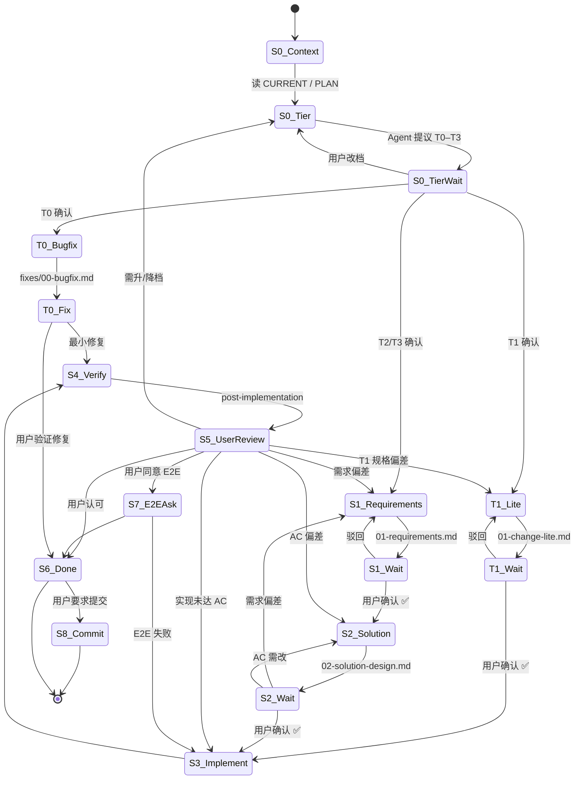

# Agent 生命周期（人机协作状态机）

> 入口地图：`.cursor/rules/ai-harness.mdc`  
> 档位定义：[planning/README.md](../planning/README.md)

每个 `⏸` 须用户确认后再进入下一状态。

## 状态图

## 档位与路径

| 档位 | 设计落盘 | 设计停点 |
|------|----------|----------|
| T0 | `.ai/fixes/<slug>/00-bugfix.md` | 定级确认 |
| T1 | `planning/<slug>/00-meta` + `01-change-lite.md` | 1 |
| T2/T3 | `planning/<slug>/00-meta` + `01` + `02` | 2 |

## 各状态职责

| 状态 | Skill / Workflow | Gate |
|------|------------------|------|
| S0.5 定级 | 所有任务入口 | `tier-classification` |
| T0 | `bugfix` | — |
| T1 设计 | `requirements-design` lite | `change-lite-review` |
| T2/T3 设计 | `requirements-design` full | `requirements-review` → `design-review` |
| S3 实现 | `feature-development` | `pre-implementation` |
| S4 自验 | — | `post-implementation` |
| S7 E2E | — | 须用户同意 |

## 规格偏差

[spec-deviation.md](./spec-deviation.md) — 先分类，更新 fixes/planning 文件，再改代码。
